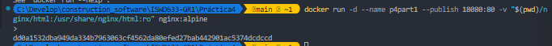
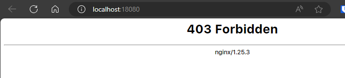
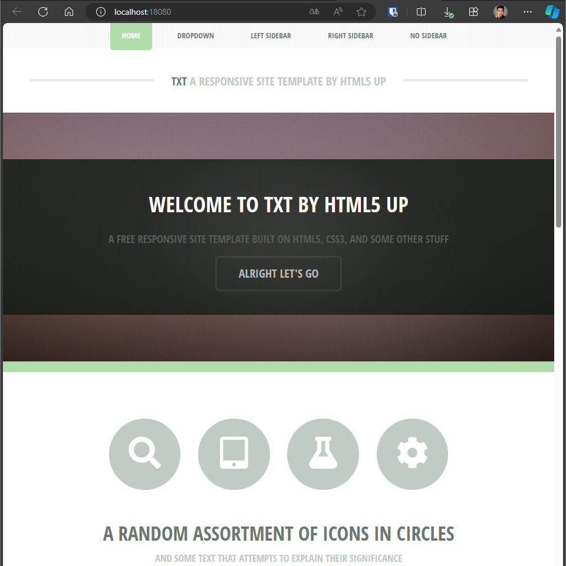
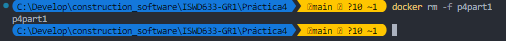
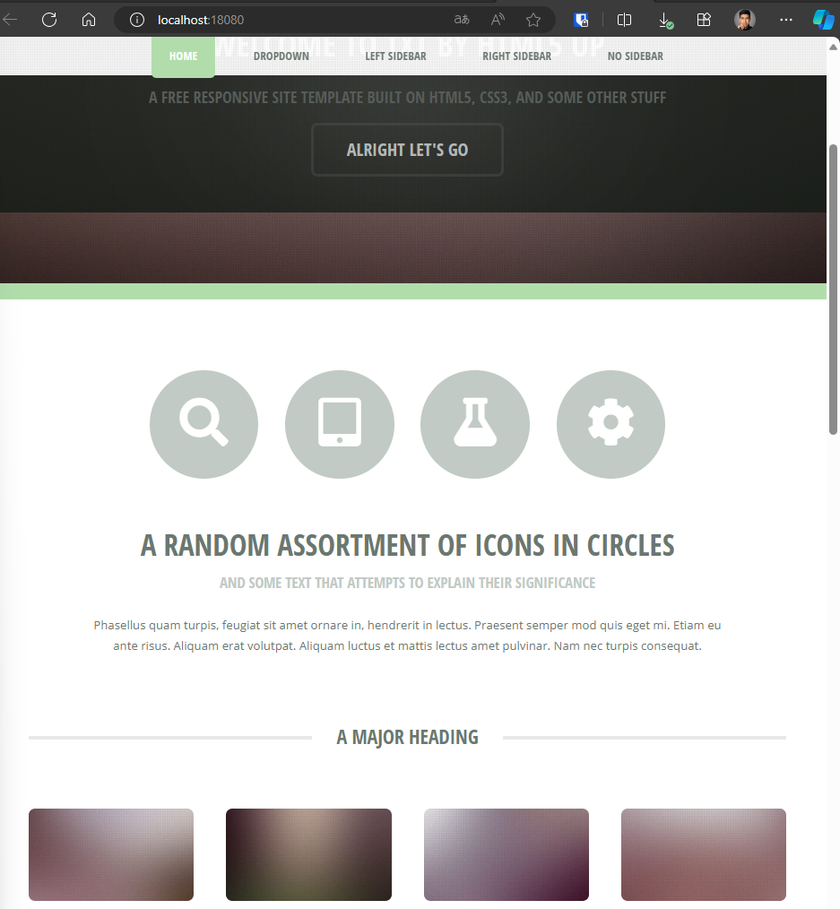

# Volúmenes

## HOST

### Volumen tipo host con la imagen nginx:alpine 
### ruta carpeta host: directorio en donde se encuentra la carpeta html en nuestro computador, usar \\
### ruta carpeta contenedor: /usr/share/nginx/html desde la documentación

```
docker run -d --name p4part1 --publish 18080:80 -v "$(pwd)/nginx/html:/usr/share/nginx/html:ro" nginx:alpine
```

### ¿Qué sucede al ingresar al servidor de nginx?
El servidor no da una respuesta a la página

### ¿Qué pasa con el archivo index.html del contenedor?
Al ser un error 403 indica que no se tiene acceso al archivo html, puede ser que no se encuentre o que no se tiene el acceso necesario para mostrarse.
### Ir a https://html5up.net/ y descargar un template gratuito - descomprimir en la carpeta html
### ¿Qué sucede al ingresar al servidor de nginx?
Se tiene respuesta del servidor

### Eliminar el contenedor

### ¿Qué sucede al crear nuevamente el mismo contenedor con volumen de tipo host a los directorios definidos anteriormente?
Se conserva ell almacenamiento de la página html

### ¿Qué hace el comando pwd?
Sirve para utilizar el path relativo desde el punto donde se encuentra la consola.
