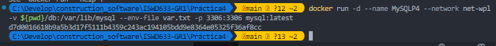

# Wordpress

### Crear red net-wp

```bash
docker network create -d bridge net-wpl    
```
### Para que persista la información es necesario conocer ¿en dónde mysql almacena la información?
Si es necesario conocer porque hay que pasar la ruta por Docker, en esta caso de MySQL sería `/var/lib/nysql/`
### ruta carpeta host: db
```
./db:/var/lib/mysql
```
### Crear contenedor de MySQL en la red net-wp

```
docker run -d --name MySQLP4 --network net-wpl -v ${pwd}/db:/var/lib/mysql --env-file var.txt -p 3306:3306 mysql:latest
```

### Para que persista la información es necesario conocer ¿en dónde wordpress almacena la información?
Si, wordpress lo hace en la ruta `/var/www/html`
### ruta carpeta host: www
### Crear contenedor de Wordpress en la red net-wp
### Personalizar la apariencia de wordpress y agregar una entrada
### Eliminar el contenedor y crearlo nuevamente, ¿qué ha sucedido?

```
```
